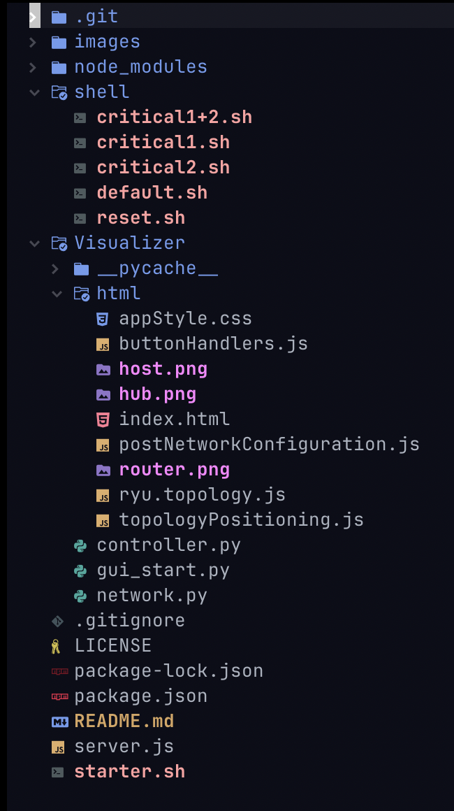
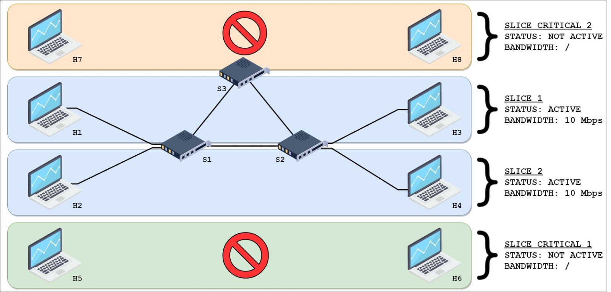
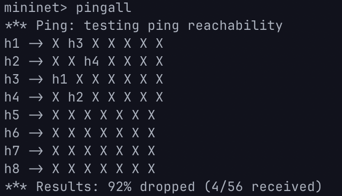
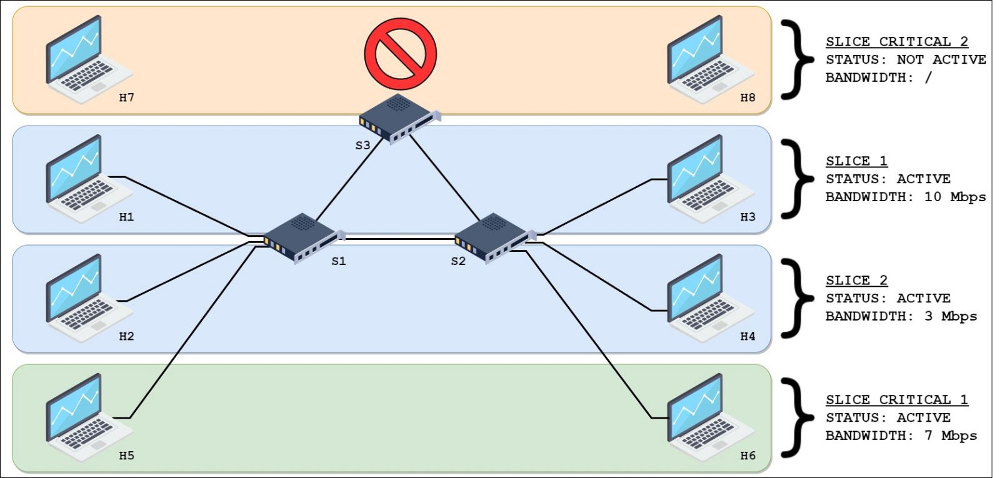
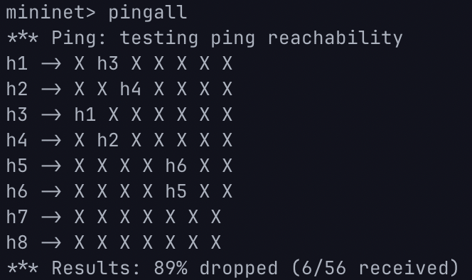
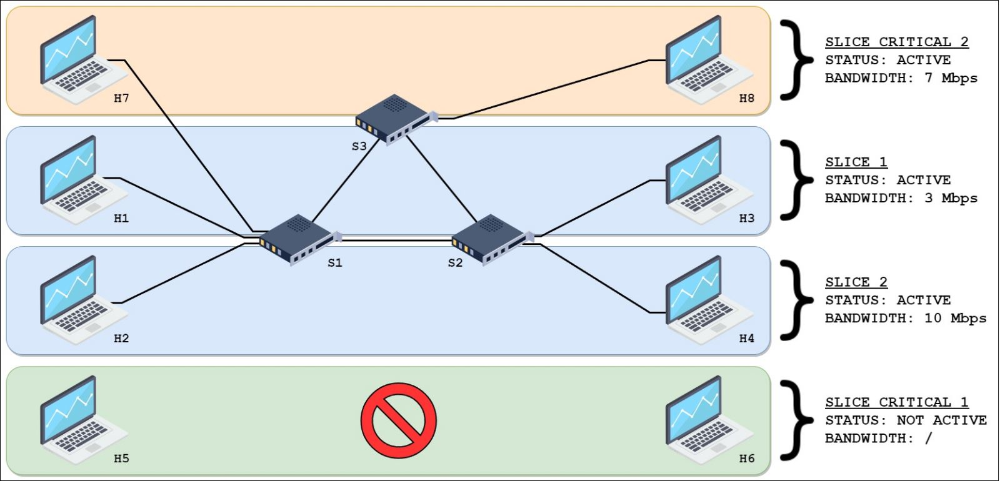
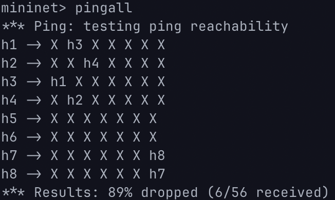
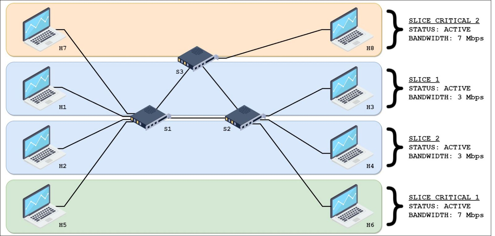
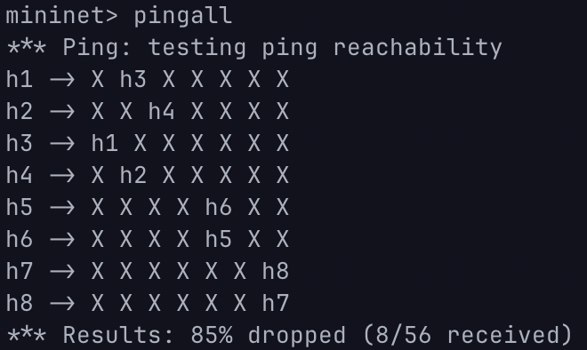

# GranelliGLS

Project for "Virtualized and Softwarized mobile networks" course held by Dr. Granelli @ UniTN

The project's name is composed of an acronym:

- GUI
- Live
- Slicing

## Table of Contents

- [Requirements](#requirements)
- [Goal](#goal)
- [Project Structure](#project-structure)
- [Installation Procedure](#installation-procedure)
- [Tunneling](#tunneling)
- [How to run the project](#how-to-run-the-project)
- [Topology and slicing](#topology-and-slicing)
  - [Default scenario](#default-scenario)
  - [Upper critical scenario](#upper-critical-scenario)
  - [Lower critical scenario](#lower-critical-scenario)
  - [Both critical scenario](#both-critical-scenario)
- [Useful Mininet commands](#useful-mininet-commands)
- [Documentation](#documentation)
- [Contributors](#contributors)

## Requirements

- Vagrant
- VirtualBox
- NodeJS
- npm
- python3
- Mininet
- Ryu
- ComNetsEmu

## Goal

We decided to mix two projects into one:

- `Interactive topology display for SDN networks`: Providing an interactive display of the topology of an SDN network.
- `On Demand SDN Slices in ComNetsEmu` : Implement a network slicing approach to enable dynamic activation/de-activation of network slices via CLI/GUIcommands

## Project Structure

Here is represented the project tree expanding only the relevant files.

</img>

The main folders and file are:

- `starter.sh` that calls everything necessary to set up the application
- `server.js` lets the visualizer launch bash scripts to dynamically change the status of the slices
- `shell/` folder contains all the bash files needed to update in real time the slices
- `Visualizer/` contains the ryu controller, the gui_start needed to visualize the webapp, the topology of the network and an html folder that contains all of the necessary scripts, style sheets and html to run the webapp

## Installation procedure

Assuming you already have npm, python3 and nodejs on your machine.

Since it is **Strongly advised** to set up comnetsemu in a Virtual Machine in order to ensure portability you are going to:

1. Install [Vagrant](https://www.vagrantup.com) and [VirtualBox](https://www.virtualbox.org)
2. Install [Comnetsemu](https://git.comnets.net/public-repo/comnetsemu#installation)

## Tunneling

In order to be able to see the visualizer in your favourite browser you need to create a private network between the Virtual Machine and your local machine. To achieve this you have to:

1. Go to comnetsemu installation folder

```BASH
~$ cd <comnetsemu_location>
```

2. Once you are in the directory you can perform an `ls` and you should see the `Vagrantfile`. From here open it with your favourite text editor and copy this line in the file to create the private network

```BASH
config.vm.network "private_network", ip: "192.168.56.2"
```

Now this ip address is assigned to the vagrant machine and now we can see the visualizer through the browser.

## How to Run the project

Now that you have installed all the tools and now that you have performed the tunneling you can finally run the project!

Our `<comnetsemu_location>` is `~/comnetsemu`, so we're going to use this from now on.

1. Go to comnetsemu location

```BASH
~$ cd comnetsemu
```

2. Start your Virtual machine

```BASH
~$ vagrant up comnetsemu
```

3. Connect to it trough Secure Shell

```BASH
~$ vagrant ssh comnetsemu
```

4. Go to the project folder

```BASH
~$ cd comnetsemu/GranelliGLS
```

5. Run the bash file to start server, visualizer, controller and topology!

```BASH
~$ bash ./starter.sh
```

6. Once the webapp is up and running open your favourite browser and paste

```
http://192.168.56.2:8080
```

Now you can interact with the WebApp!

In the terminal where you ran the bash script you are given the mininet's CLI. In this way you can perform checks on the slices in real time!

**Note** in step 2 and 3 it is not necessary to call `comnetsemu` after vagrant up and ssh, but it is advised in case of multiple VMs running in your machine at the same time.

## Topology and Slicing

We decided to keep this topology for the project:

Immagine Topologia

### Default Scenario

</img>

In the Default Scenario we have 4 hosts, 3 switches and 2 slcies are active:

- Upper slice between h1 and h3 using a 10 Mbps link
- Lower slice between h2 and h4 using a 10 Mbps link

This is what we are going to get with the pingall command

</img>

If we check the connection among the hosts we get:

</img>


### Lower Critical Scenario

</img>

In the lower critical scenario we add host 5 and host 6 to the network with an higher priority than the one before.

This scenario has 6 hosts, 3 switches and 3 slices:

- Upper slice between h1 and h3 using a 10 Mbps link
- Slice between h2 and h4 using a 3 Mbps link
- Slice between h5 and h6 using a 7 Mbps link

This is what we are going to get with the pingall command

</img>

If we check the connection among the hosts we get:

</img>

</img>

</img>

### Upper Critical Scenario

</img>

In the upper critical scenario we add host 7 and host 8 to the network with an higher priority than the one before.

This scenario has 6 hosts, 3 switches and 3 slices:

- Slice between h1 and h3 using a 3 Mbps link
- Slice between h2 and h4 using a 10 Mbps link
- Slice between h7 and h8 using a 7 Mbps link

This is what we are going to get with the pingall command

</img>

If we check the connection among the hosts we get:

</img>

</img>

</img>

### Both Critical Scenario

</img>

In this special scenario we add both host 5 and 6, and host 7 and host 8 to the network with an higher priority than the one before.

This scenario has 8 hosts, 3 switches and 4 slices:

- Slice between h1 and h3 using a 3 Mbps link
- Slice between h2 and h4 using a 3 Mbps link
- Slice between h5 and h6 using a 7 Mbps link
- Slice between h7 and h8 using a 7 Mbps link

This is what we are going to get with the pingall command

</img>

Note that here all hosts are connected.

If we check the connection among the hosts we get:

</img>

</img>

</img>

</img>

## Useful Mininet commands

Once the application is up and running you can run some code in mininet to check the status of the network.

The `mininet>` is used instead of `~$` to underline the fact that we are inside the mininet CLI while the application is running and not on the standard terminal.

The most useful commands are:

- `mininet> nodes` to check the available nodes in the network
- `mininet> links ` to display network's links
- `mininet> pingall`, which lets all hosts ping each other
- `mininet> <src_host> ping <dst_host>` e.g. `h1 ping h3` which lets an host send some packets through the network to check its reachability
- `mininet> iperf <src_host> <dst_host>` e.g. `iperf h1 h3` which lets an host check the bandwidth available

**Note**: To stop commands that do not end like `ping`command it is advised to launch a `SIGINT` via `ctrl+c`.

## Documentation

For more information on the tools used please read these:

- [Mininet](http://mininet.org/walkthrough)
- [RYU Documentation](https://ryu.readthedocs.io/en/latest/)
- [RYU RestAPI](https://ryu.readthedocs.io/en/latest/app/ofctl_rest.html)
- [OpenSwitch Command reference](https://docs.pica8.com/display/PICOS2111cg/PicOS+Open+vSwitch+Command+Reference)

## Contributors

- [Stefano Dal Mas](https://github.com/StefanoDalMas)
- [Ion Andy Ditu](https://github.com/Ion-Andy)
- [Lorenzo Dongili](https://github.com/dongi01)
